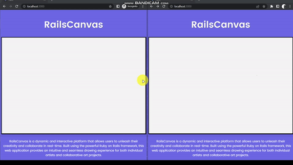

<h1>RailsCanvas</h1>

RailsCanvas is a dynamic and interactive platform that allows users to unleash their creativity and collaborate in real-time. Built using the powerful Ruby on Rails framework, this web application provides an intuitive and seamless drawing experience for both individual artists and collaborative art projects.

